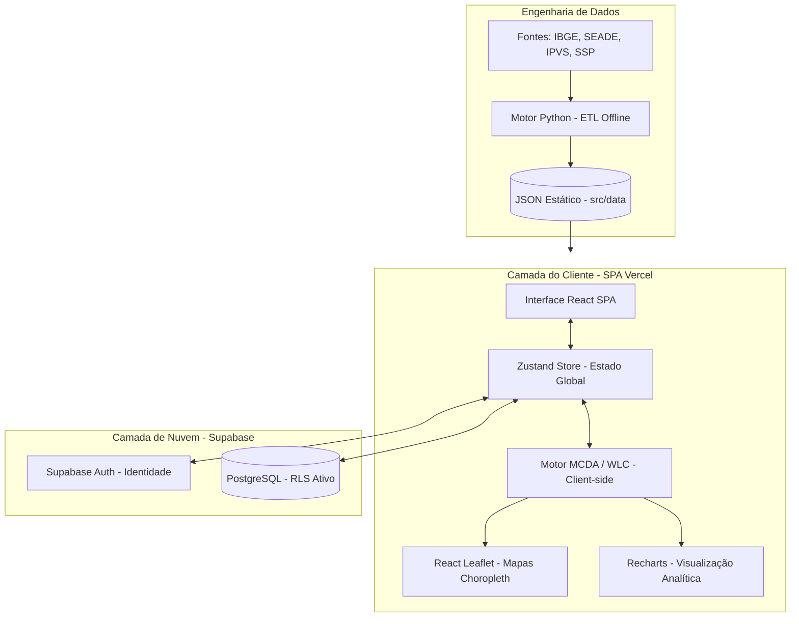

# 📊 Urbanis — Inteligência Territorial & Apoio à Decisão

O **Urbanis** é uma plataforma web de alta performance voltada para inteligência territorial e apoio à decisão geoespacial, projetada para a análise comparativa e estratégica de distritos na cidade de São Paulo.

A aplicação cruza dados públicos consolidados para calcular índices de aderência de negócios de forma totalmente determinística, permitindo que analistas e empreendedores identifiquem os melhores polos para expansão ou instalação de operações.

---

## 🚀 Principais Funcionalidades

### 🗺️ Visualização Geográfica Interativa
*   **Mapas Coropléticos Dinâmicos**: Renderização fluida de dados setoriais e pontuações por distrito através do Leaflet.
*   **Camadas Temáticas Individuais**: Alternância instantânea entre dados consolidados de **Demografia (IPVS/IBGE)**, **Segurança (SSP/Ocorrências)**, **Mobilidade (Fluxo de Linhas/Estações de Metrô e Trem)** e a pontuação estratégica consolidada.

### 📐 Análise Multicritério Determinística (MCDA / WLC)
*   **Weighted Linear Combination (WLC)**: O sistema utiliza modelos matemáticos de apoio à decisão multicritério executados diretamente no cliente (*client-side*).
*   **Perfis Operacionais Científicos**: Pesos específicos pré-configurados e cientificamente balanceados para segmentos reais do mercado:
    *   **Academias** (Populares e Premium)
    *   **Restaurantes** (Fast Food e Gourmet)
    *   **Farmácias**
    *   **Logística e Centros de Distribuição**
    *   **Varejo Geral**
*   *Nota: O motor de cálculo avalia proximidade de infraestrutura de transporte, taxas de vulnerabilidade social (IPVS), densidade demográfica e índices de segurança local, sem induzir previsões arbitrárias ou heurísticas ocultas.*

### 🔍 Comparador de Distritos Lado a Lado
*   Painel analítico para auditoria cruzada de dois distritos de São Paulo.
*   Comparação direta em formato radar ou barras com métricas brutas normalizadas de infraestrutura, atratividade e risco social.

### 🔒 Persistência de Estudos & Autenticação Segura
*   **Fluxo de Identidade Supabase**: Login e cadastro protegidos com políticas estritas de segurança de dados.
*   **Gestão de Estado Híbrido**: Persistência automática dos estudos criados e salvos em nuvem (banco de dados relacional PostgreSQL do Supabase).
*   **Fallback para Convidado (Offline)**: Modos offline ou de visualização rápida salvam dados no `localStorage` do navegador para alta disponibilidade e testes sem atrito.

---

## 🛠️ Stack Tecnológica

*   **SPA Framework:** React 18 & TypeScript
*   **Build System:** Vite
*   **Visualização Espacial:** React Leaflet & Leaflet Engine (SVG/Canvas)
*   **Visualização Analítica:** Recharts (Gráficos de densidade e comparação)
*   **Estilização:** Tailwind CSS (Design System escuro forçado no Login, responsividade e suporte a temas globais)
*   **Gerenciamento de Estado:** Zustand (Estado reativo centralizado)
*   **Backend as a Service:** Supabase (Auth & Real-time Client API)
*   **Banco de Dados:** PostgreSQL (Tabela `projects` com RLS - *Row Level Security*)
*   **Hospedagem & CD/CI:** Vercel (Continuous Deployment sincronizado via GitHub Hooks)

---

## 🏗️ Arquitetura do Sistema

A arquitetura do Urbanis foi projetada para minimizar custos de servidor e oferecer tempos de resposta inferiores a **10ms** para cálculos complexos na tela do usuário.



1.  **ETL & Processamento de Dados (Offline)**: Os dados públicos territoriais de São Paulo são coletados, limpos e consolidados em um motor Python e encapsulados em um JSON estático otimizado (`src/data/urbanis_data.json`).
2.  **Motor WLC Client-Side**: O navegador realiza todas as operações matemáticas sob demanda a partir da seleção de pesos do usuário ou perfis pré-definidos, garantindo velocidade instantânea de renderização.
3.  **Persistência em PostgreSQL**: Quando conectado, o Zustand sincroniza de forma transparente os dados de projetos cadastrados com a tabela `projects` do banco de dados na nuvem através do Supabase.

---

## 📂 Estrutura de Pastas

A estrutura segue a convenção clássica de aplicações SPA modernas com componentização clara e separação de responsabilidades:

```text
frontend/
├── public/                 # Recursos públicos e assets estáticos
├── src/
│   ├── assets/             # Estilos globais e imagens
│   ├── components/
│   │   ├── charts/         # Gráficos customizados em Recharts
│   │   ├── dashboard/      # Componentes do mapa e painéis informativos
│   │   ├── layout/         # Componentes de estrutura (Sidebar, Header)
│   │   └── ui/             # Componentes base e primitivos de interface
│   ├── config/             # Configurações de serviços externos (Supabase Client)
│   ├── data/               # Banco de dados territorial estático (JSON compilado)
│   ├── lib/                # Funções utilitárias e helpers
│   ├── pages/              # Páginas e views completas da aplicação (Login, Dashboard, Compare)
│   ├── store/              # Gerenciador de estado global via Zustand (useUrbanStore)
│   ├── types/              # Definições de tipos TypeScript (.ts)
│   ├── App.tsx             # Arquivo raiz do roteamento e guards de autenticação
│   └── main.tsx            # Ponto de entrada do React
├── .env.example            # Exemplo de configuração de variáveis de ambiente
├── tailwind.config.js      # Configurações de tokens visuais do Tailwind CSS
└── vite.config.ts          # Configurações de empacotamento do Vite
```

---

## 🔧 Como Executar Localmente

### Pré-requisitos
*   [Node.js](https://nodejs.org/) (versão 18 ou superior recomendado)
*   [npm](https://www.npmjs.com/) ou [yarn](https://yarnpkg.com/)

### Passo a Passo

1.  **Clonar o Repositório**
    ```bash
    git clone https://github.com/Damprelli11/urbanis-plataform.git
    cd urbanis-plataform
    ```

2.  **Instalar Dependências**
    Instale os pacotes necessários utilizando o parâmetro de resolução de dependências legadas se houver conflito de dependências estritas no ecossistema React:
    ```bash
    npm install --legacy-peer-deps
    ```

3.  **Configurar Variáveis de Ambiente**
    Crie o seu arquivo de variáveis locais baseado no arquivo `.env.example`:
    ```bash
    cp .env.example .env.local
    ```
    Abra o `.env.local` e configure a URL e a Anon Key do seu projeto Supabase.

4.  **Iniciar Servidor de Desenvolvimento**
    ```bash
    npm run dev
    ```
    A aplicação estará acessível em `http://localhost:5173/`.

5.  **Compilar para Produção**
    ```bash
    npm run build
    ```
    Os arquivos estáticos otimizados para produção serão gerados na pasta `/dist`.

---

## 🔒 Variáveis de Ambiente (`.env.example`)

Para que as funcionalidades de persistência e autenticação de usuários funcionem corretamente, configure as seguintes chaves obtidas no painel de controle do seu projeto no Supabase:

```env
# URL base da API do seu projeto Supabase
VITE_SUPABASE_URL=https://seu-projeto-id.supabase.co

# Chave pública anon/public do Supabase
VITE_SUPABASE_ANON_KEY=sua-chave-anon-publica-do-supabase
```

---

## 📸 Demonstração Visual

Abaixo, os principais painéis que consolidam a interface analítica e segura do Urbanis:

| Tela de Autenticação Segura | Painel Principal de Inteligência | Comparador Cruzado de Distritos |
| :---: | :---: | :---: |
|  <br> *(Interface de autenticação moderna e forçada no tema escuro)* |  <br> *(Visualização do mapa coroplético e índices de atratividade)* |  <br> *(Análise detalhada de performance lado a lado)* |

---

## 🗺️ Roadmap de Evolução

- [x] **Integração Supabase**: Conexão segura e persistência de estudos em nuvem.
- [x] **Arquitetura Resiliente**: Fallback automático para `localStorage` caso o usuário opte pelo modo visitante.
- [x] **Ajuste Fino de Algoritmos**: Implementação do cálculo normalizado via WLC para diferentes perfis reais.
- [ ] **Exportação Científica**: Exportação otimizada em PDF estruturado contendo mapas e gráficos para anexação direta em trabalhos acadêmicos ou propostas de investimento.
- [ ] **Expansão Territorial**: Suporte a cruzamento de dados de outras regiões metropolitanas (ex: Baixada Santista e Campinas).

---

## 📄 Licença

Este projeto está sob a licença MIT. Consulte o arquivo [LICENSE](LICENSE) para obter mais detalhes.

---

<div align="center">
  <p>Desenvolvido para fins acadêmicos e analíticos como parte do Trabalho de Conclusão de Curso (TCC).</p>
  <strong>Grupo FourWave — 2026</strong>
</div>
